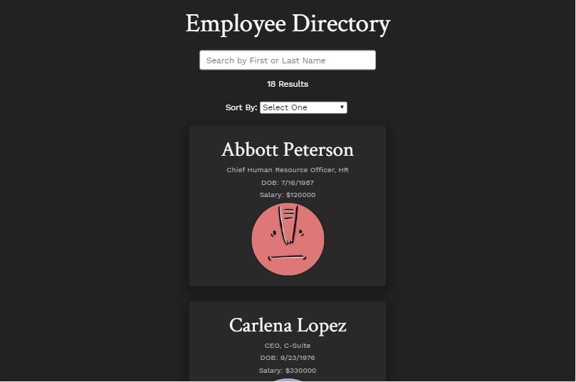

# Employee Directory

An employee directory app built with React, created for The Coding Bootcamp at Johns Hopkins Engineering. Users can use this application to explore an employee roster through filtering, sorting, and searching.

## Description

This assignment required us to break up our application's UI into components, manage component state, and respond to user events. It gave me experience using React hooks such as useState and useEffect, and I also got additional practice using JavaScript array methods like map and filter.

I originally wanted to generate my employee data from the [Random User Generator](https://randomuser.me/) API, but unfortunately the site's server was down when I was working on it and had to resort to using my own data from a JSON file. I still wanted to incorporate an API, so I ended up getting "headshots" from the [Adorable Avatars](https://api.adorable.io/) API.

## Preview

## Assignment

Given a table of random employees, when the user loads the page, a table of employees will render.
The user is able to:

- Sort the table by at least one category
- Filter the users by at least one property.

## License

MIT License

Copyright (c) 2020 Jordyn Saltzman

Permission is hereby granted, free of charge, to any person obtaining a copy of this software and associated documentation files (the "Software"), to deal in the Software without restriction, including without limitation the rights to use, copy, modify, merge, publish, distribute, sublicense, and/or sell copies of the Software, and to permit persons to whom the Software is furnished to do so, subject to the following conditions: The above copyright notice and this permission notice shall be included in all copies or substantial portions of the Software. THE SOFTWARE IS PROVIDED "AS IS", WITHOUT WARRANTY OF ANY KIND, EXPRESS OR IMPLIED, INCLUDING BUT NOT LIMITED TO THE WARRANTIES OF MERCHANTABILITY, FITNESS FOR A PARTICULAR PURPOSE AND NONINFRINGEMENT. IN NO EVENT SHALL THE AUTHORS OR COPYRIGHT HOLDERS BE LIABLE FOR ANY CLAIM, DAMAGES OR OTHER LIABILITY, WHETHER IN AN ACTION OF CONTRACT, TORT OR OTHERWISE, ARISING FROM, OUT OF OR IN CONNECTION WITH THE SOFTWARE OR THE USE OR OTHER DEALINGS IN THE SOFTWARE.
